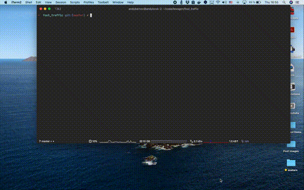

[](https://badge.fury.io/rb/foot_traffic)

# Foot Traffic :dancers: :dancing_men:

A natural companion to an amazing [Ferrum](https://github.com/rubycdp/ferrum) gem that controls a fleet of Chrome windows and tabs and simulates real user interaction with your web applications from any Ruby scripts. Works naturally with your system Chrome or Chromium, no extra magic like Selenium or WebDrivers needed.

```rb
require "foot_traffic"
using FootTraffic

FootTraffic::Session.start do |window|
  window.tab_thread { |tab| tab.goto "https://www.lewagon.com" }
  window.tab_thread { |tab| tab.goto "https://www.lewagon.com/berlin" }
  window.tab_thread { |tab| tab.goto "https://www.lewagon.com/paris" }
end
```



## Installation

Add this line to your application's Gemfile:

```ruby
gem 'foot_traffic'
```

And then execute:

    $ bundle install

Or install it yourself as:

    $ gem install foot_traffic
    
## Can I use it in my Rails system tests?

Take a look at [Cuprite](https://github.com/rubycdp/cuprite) that allows Capybara to work with Ferrum instead of Selenium/ChromeDriver. The goal of Foot Traffic is not Rspec integration, but to create simple and reproducible Ruby scripts that automate common usage scenarios for moderate load testing of production applications or as a visual aid in development.


> — Do you need write integration tests without Selenium/ChromeDriver dependency?  
> — Use Cuprite and write specs with Capybara.

> — Do you want to make sure that your app handles Action Cable properly for multiple users and see the interaction play out before your eyes?  
> — Use Foot Traffic and create a script that can be commited to the repo and run from Rake task.

## Powered by Ferrum :heart:

At [Le Wagon](https://www.lewagon.com) we love Ferrum and use it as a Selenium replacement to run system tests for our learning platforms. We highly recommend you do the same, and here's why

> Ferrum connects to the browser by CDP protocol and there's no Selenium/WebDriver/ChromeDriver dependency. The emphasis was made on a raw CDP protocol because Chrome allows you to do so many things that are barely supported by WebDriver because it should have consistent design with other browsers.—[Ferrum on GitHub](https://github.com/rubycdp/ferrum)

Pure Ruby + pure Chrome—what's not to like?

## Tutorial

### Single thread

In a simplest case, all you need is to `require "foot_traffic"`, put in the `using FootTraffic` to enable Ferrum [refinements](https://docs.ruby-lang.org/en/master/syntax/refinements_rdoc.html) and proceed with opening a session block. It yields a `window` object that is an instance of `Ferrum::Context` ([source](https://github.com/rubycdp/ferrum/blob/master/lib/ferrum/context.rb)). You can create a "tab" instance with a `new_tab` method and control it through Ferrum [methods](https://github.com/rubycdp/ferrum#examples) that are designed to be close to [Puppeteer](https://github.com/puppeteer/puppeteer/).

```rb
require "foot_traffic"
using FootTraffic

FootTraffic::Session.start do |window|
  window.new_tab.goto "https://www.lewagon.com"
  window.new_tab.goto "https://www.lewagon.com/berlin"

  paris = window.new_tab
  paris.goto "https://www.lewagon.com/paris"
  paris.at_css('[href="/paris/apply"]').click
  paris.at_css("#apply_first_name").focus.type("Alan")
  paris.at_css("#apply_last_name").focus.type("Turing", :Tab)
end
```

In this case, all the instructions to the browser will run in a _single thread_ of execution, so you will see a browser performing actions consequetively.

### Multiple threads

As Ferrum is thread-safe by design, you can execute the same scenario in parallel. `tab_thread` method opens a block that yields the instance of `Ferrum::Page` ([source](https://github.com/rubycdp/ferrum/blob/master/lib/ferrum/page.rb)).

```rb
require "foot_traffic"
using FootTraffic

FootTraffic::Session.start do |window|
  window.tab_thread { |tab| tab.goto "https://www.lewagon.com" }
  window.tab_thread { |tab| tab.goto "https://www.lewagon.com/berlin" }
  window.tab_thread do |paris|
    paris.goto "https://www.lewagon.com/paris"
    paris.at_css('[href="/paris/apply"]').click
    paris.at_css("#apply_first_name").focus.type("Alan")
    paris.at_css("#apply_last_name").focus.type("Turing", :Tab)
  end
end
```

Now, all the tabs will run **in parallel** (with limits to Ruby concurrency model, of course). After the session block finishes execution, browser will stay open indefinitely—until you `Ctrl-C` the original script. That might be useful if you want to use Chrome Developer Tools on open pages.

### Setting duration

If your script does not end with a session block and you want to continue running your code—set the duration time for the session.

```rb
require "foot_traffic"
using FootTraffic

FootTraffic::Session.start(duration: 10) do |window|
  window.tab_thread { |tab| tab.goto "https://www.lewagon.com" }
  window.tab_thread { |tab| tab.goto "https://www.lewagon.com/berlin" }
  window.tab_thread do |paris|
    paris.goto "https://www.lewagon.com/paris"
    paris.at_css('[href="/paris/apply"]').click
    paris.at_css("#apply_first_name").focus.type("Alan")
    paris.at_css("#apply_last_name").focus.type("Turing", :Tab)
  end
end
```

Now the block will exit after 10 seconds.

### Quit when all threads quit

If you don't want to guess the time for pages to stay open—you can use the `quit` parameter of session. Note that in that case, you need to wait for all your threads to exit. As a convenience, `session` block yields a second argument that is a primitive implementation of a thread pool.

```rb
require "foot_traffic"
using FootTraffic

FootTraffic::Session.start(quit: true) do |window, pool|
  pool << window.tab_thread { |tab| tab.goto "https://www.lewagon.com" }
  pool << window.tab_thread { |tab| tab.goto "https://www.lewagon.com/berlin" }
  pool << window.tab_thread do |paris|
    paris.goto "https://www.lewagon.com/paris"
    paris.at_css('[href="/paris/apply"]').click
    paris.at_css("#apply_first_name").focus.type("Alan")
    paris.at_css("#apply_last_name").focus.type("Turing", :Tab)
  end
  pool.wait
end
```

Now, the session block will exit as soon as the last action in the last tab completes—your script can run further!

If you want to see how your website handles multiple concurrent visits—you can use the `clone` parameter that will open as many Chrome windows as you want and run the tab scenario in each of them.

### Customizing

As this puts the strain on your system's resources, it makes sense to also use some of the Ferrum's [options](https://github.com/rubycdp/ferrum#customization) to set higher timeouts for Chrome startup and page loads. `slowmo` parameter might be particularly useful for simulating real user behavior, as it will add a small wait before executing each action, including sending keyboard keys.

```rb
require "foot_traffic"
using FootTraffic

opts = {
  process_timeout: 10,
  timeout: 100,
  slowmo: 0.1,
  window_size: [1024, 768]
}

FootTraffic::Session.start(options: opts, quit: true, clones: 10) do |window, pool|
  pool << window.tab_thread { |tab| tab.goto "https://www.lewagon.com" }
  pool << window.tab_thread { |tab| tab.goto "https://www.lewagon.com/berlin" }
  pool << window.tab_thread { |paris|
    paris.goto "https://www.lewagon.com/paris"
    paris.at_css('[href="/paris/apply"]').click
    paris.at_css("#apply_first_name").focus.type("Alan")
    paris.at_css("#apply_last_name").focus.type("Turing", :Tab)
  }
  pool.wait
end
```

You can also set the `headless` option to `true` to perform script in headless mode. If you open too many concurrent tabs, or the number of clones becomes too high—your system will run out of memory. To prevent that, Foot Traffic will raise the
`FootTraffic::ResourceOverloadError` once `ThreadError`, `RuntimeError`, `Errno::EMFILE`, or `Errno::ECONNRESET` start propagating.

```rb
require "foot_traffic"
using FootTraffic

opts = {
  headless: true,
  process_timeout: 10,
  timeout: 100,
  slowmo: 0.1,
  window_size: [1024, 768]
}

begin
  FootTraffic::Session.start(options: opts, quit: true, clones: 10) do |window, pool|
    pool << window.tab_thread { |tab| tab.goto "https://www.lewagon.com" }
    pool << window.tab_thread { |tab| tab.goto "https://www.lewagon.com/berlin" }
    pool << window.tab_thread { |paris|
      paris.goto "https://www.lewagon.com/paris"
      paris.at_css('[href="/paris/apply"]').click
      paris.at_css("#apply_first_name").focus.type("Alan")
      paris.at_css("#apply_last_name").focus.type("Turing", :Tab)
    }
    pool.wait
  end
rescue FootTraffic::ResourceOverloadError
  puts "Oops..."
  exit(1)
end
```

### Cookies

You can also control cookies for each tab. Keep in mind that in this case you don't want all your actions to run entirely concurrently, as the values of cookies may leak between tabs. Here's an example on how to avoid it:

```rb
require "concurrent" # concurrent-ruby

tokens = [] # imaginary array of auth tokens

cookies = Concurrent::Hash.new

opts = {
  headless: false, # Headless or not
  timeout: 300, # How long to wait for new tab to open, set for high value
  slowmo: 0.1, # How fast do you want bots to type
  window_size: [1200, 800]
}

FootTraffic::Session.start(options: opts, quit: true) do |window, pool|
  tokens.each do |token|
    sleep(1) # Need to sleep so we can propely save cookies
    pool << window.with_tab { |tab|
      tab.goto("https://example.com/sign_in/#{token}")
      cookies[token] = tab.cookies["_example_session"].value
    }
  end
  pool.wait
end

FootTraffic::Session.start(options: opts) do |window|
  tokens.each do |token|
    sleep(1) # Wait to properly load cookies
    window.with_tab do |tab|
      tab.cookies.clear
      tab.cookies.set(
        name: "_example_session",
        domain: "example.com",
        value: cookies[token]
      )
      tab.goto("https://example.com/protected_route")
    end
  end
end
```

Check out the [examples](https://github.com/lewagon/foot_traffic/tree/master/examples) folder to study some of the scripts above.

## Development

After checking out the repo, run `bin/setup` to install dependencies. Then, run `rake spec` to run the tests. You can also run `bin/console` for an interactive prompt that will allow you to experiment.

To install this gem onto your local machine, run `bundle exec rake install`. To release a new version, update the version number in `version.rb`, and then run `bundle exec rake release`, which will create a git tag for the version, push git commits and tags, and push the `.gem` file to [rubygems.org](https://rubygems.org).

## Contributing

Bug reports and pull requests are welcome on GitHub at https://github.com/lewagon/foot_traffic.

## License

The gem is available as open source under the terms of the [MIT License](https://opensource.org/licenses/MIT).
